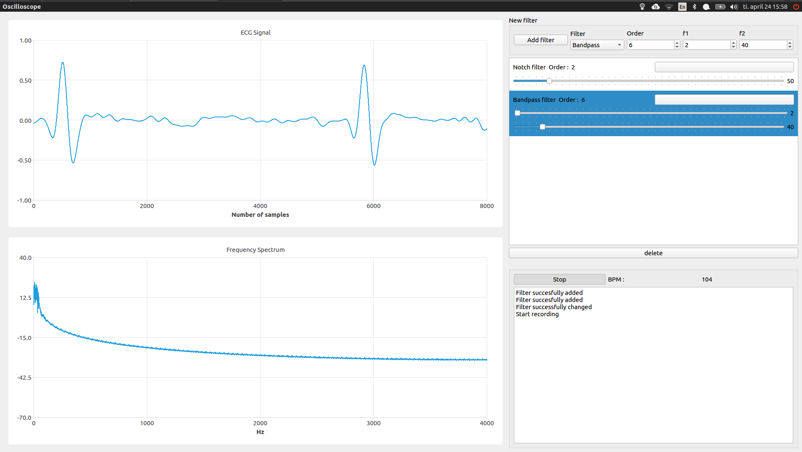
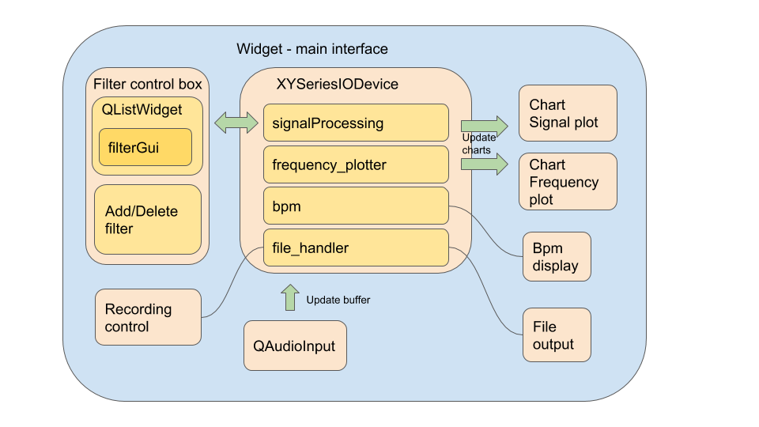

# Project sketch

This project is digital processing ECG signal and classification of the siginal with machine learning algorithms. This is part of the cource "Effective C/C++ programming" at Høgskolen i Oslo og Akershus. It will be written exclusively in C++ with Qt framework. 

Qt GUI will be the skeleton of the program. Sensor for this program will be 3 lead ECG made as result of "Medical instrumentation". ECG signal will go through basic 2.order bandpass filter, then octo-coupler and will be sampled by computer thorugh 3.5mm audio jack. Qt interface will show oscilloscope like signal view and other measured parameters ( Bpm, etc ) and result of classification.

## QML documentation:
* https://doc.qt.io/qt-5.10/qmltypes.html

